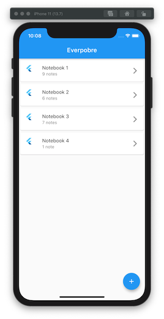
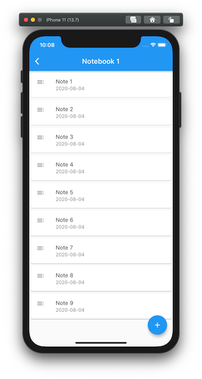
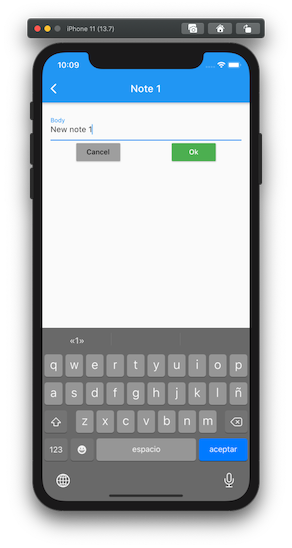
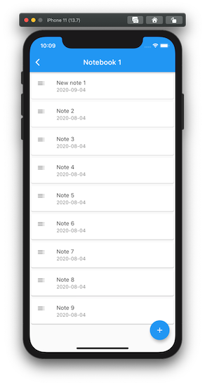
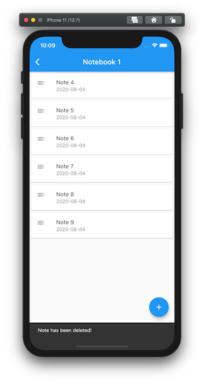
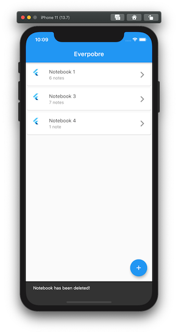
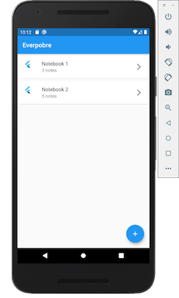
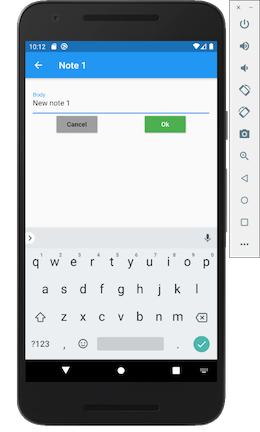
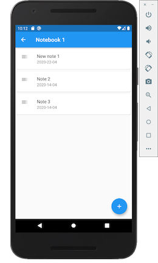
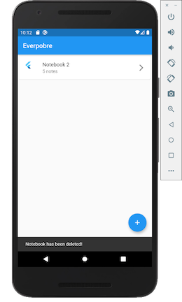

## Objetivo

Aplicar los fundamentos de **Flutter** en el desarrollo de aplicaciones móviles como alternativa a las tecnologías nativas.

Para ello se ha implementado una versión súper reducida de *Evernote*. Simula una lista de Notebooks y dentro de cada uno de ellos a su vez hay una lista de Notes.

- [Dart](https://dart.dev/)
- [Flutter](https://flutter.dev/)
- Visual Studio Code

## Especificaciones

- Crear un _constructor nombrado_ que carga datos de pruebas: varios Notebooks que contienen a varias Notes.
- Lista de Notebooks. Se pueden crear nuevos Notebooks mediante un `FloatingActionButton` y eliminarlos mediante un `Dismissible` informando de ello al usuario con un `SnackBar`.
- Lista de Notes de cada Notebook. Se llega por medio de la navegación desde la lista de Notebooks. Se pueden crear nuevos Notes mediante un `FloatingActionButton` y eliminarlos mediante un `Dismissible` informando de ello al usuario con un `SnackBar`.
- Crear dos rutas que permiten navegar desde el grid de Notebooks a la lista de Notes que contiene dicho Notebook.

### Mejoras sobre las especificaciones

- En la lista de Notebooks se muestra el número de Notes. Dicho número de Notes se actualiza según se van añadiendo o borrando Notes.
- En la lista de Notes se muestra en el `AppBar` el título del Notebook seleccionado.
- Se crea un Widget de detalle de Note que permite editar su contenido, se usa `TextField`.
- Se ha creado una función que genera de forma aleatorio el número de Notebooks y el número de Notes de cada uno de ellos. Asimismo tiene su propio test.
- Se ha ampliado la clase _TextResources_ para que almacene todos los textos de la aplicación, de modo que se encuentren centralizados para su posterior localización y mantenimiento.
- Todos las rutas de la aplicación se encuentran centralizadas para su fácil mantenimiento en _DescriptionRoute_. Asimismo la clase _ArgumentsRoute_ se encarga de encapsular la información que se envía entre escenas.

##### Capturas de pantallas iOS

##### Capturas de pantallas Android

